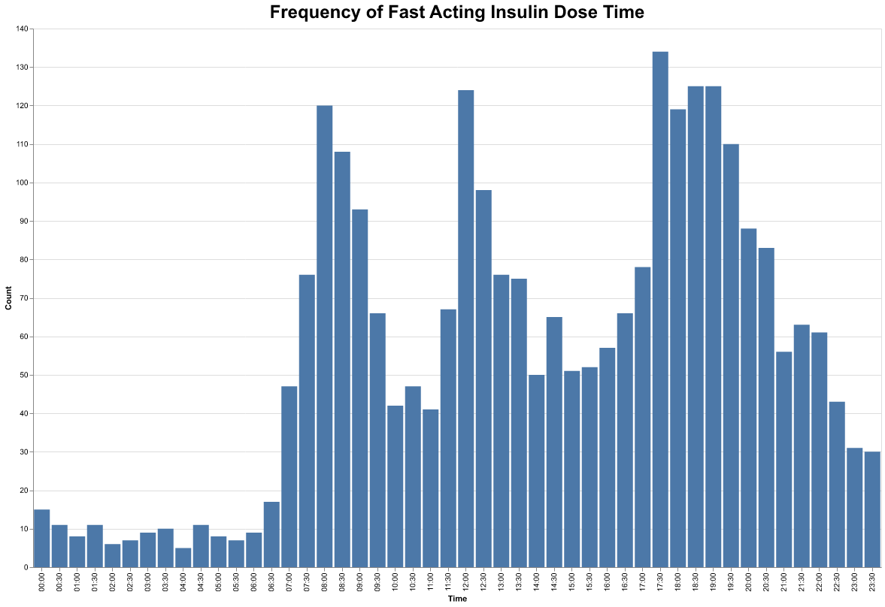

# Dexcom CGM Data Analyzer



Scripts that take a CSV export of Dexcom continuous blood glucose monitor (CGM) data and generate plots to visualize the data in a meaningful way.

### Exporting CGM Data

Dexcom allows raw patient CGM data to be exported in CSV format. Follow the [instructions given here](https://www.dexcom.com/en-us/faqs/can-i-export-raw-data) to export data.

Add your CSV to the `data/` directory and rename it `export.csv`. A sample CSV is provided, and will be used if no `export.csv` is provided.

### Scripts
`histogram.py`
  - Generates histograms displaying the frequency of fast-acting insulin, long-acting insulin, and carbohydrate times.

`mean_glucose_plot.py`
  - Generates a scatter plot of average blood glucose values for each day.

#### To Run

Add your CGM data CSV name `export.csv` to the `data/` directory. Run a script from the main directory with:

```sh
python3 <script_name.py>
```

### Notes
- `histogram.py`
    - This script groups data into 30 minute buckets.
    - This script excludes carb entries less than 5 grams. This is to exclude small "correction" food that is used to sightly blood glucose when low. The justification for this is to only track more significant meals and snacks. This is adjustable by changing this line in the script:
      ```python
      df = df.loc[df.carbs >= 5.0]
      ```
- `mean_glucose_plot.py`
    - Dexcom CGMs will record blood glucose levels below 45 mg/dL as 'Low'. This script converts those values to 40 for simplicity. Actual values could be lower. This is adjustable by changing this line:
      ```python
      df['glucose_value'] = df['glucose_value'].replace('Low', 40)
      ```
